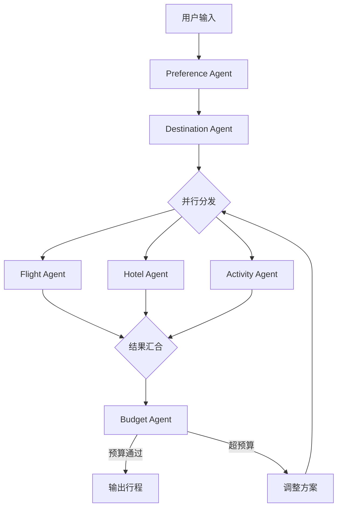

# 多Agent智能旅游行程规划系统 - 完整实施计划

## 一、项目定位与目标

面向求职者的**企业级多Agent旅游规划系统**开源项目，包含：
- 3种语言实现（Python主力 + Java + Go）
- 完整面试准备套件（八股文、STAR法则、简历模板）
- 从零到面试的全流程指南

## 二、技术架构设计

### 核心架构：Pipeline + 并行 + 预算循环



### 6个Agent角色设计

| Agent | 职责 | 核心工具/API |
|-------|------|-------------|
| Preference Agent | 对话式偏好收集 | 结构化问答、NLU |
| Destination Agent | 目的地推荐 | 旅游数据库、天气API |
| Flight Agent | 航班搜索比价 | Amadeus API(模拟) |
| Hotel Agent | 酒店匹配推荐 | Booking API(模拟) |
| Activity Agent | 景点/餐厅/行程 | Google Maps API(模拟) |
| Budget Agent | 预算追踪与校验 | 成本计算引擎 |

## 三、项目目录结构

```
20260406_智能旅游行程规划系统/
├── README.md                          # 超详细项目说明（面向小白）
├── plan.md                            # 本计划文档
│
├── docs/                              # 面试准备文档
│   ├── 01-八股文.md                    # 多Agent系统核心八股文
│   ├── 02-简历模板.md                  # 简历写法（含STAR法则）
│   ├── 03-面试QA.md                    # 面试常见问题与回答
│   ├── 04-架构设计详解.md              # 架构图解 + 设计决策
│   └── 05-代码讲解.md                  # 逐模块代码讲解
│
├── python/                            # Python实现（主力版本）
│   ├── README.md
│   ├── requirements.txt
│   ├── config/
│   │   └── settings.py                # 配置管理
│   ├── agents/
│   │   ├── __init__.py
│   │   ├── base_agent.py              # Agent基类
│   │   ├── preference_agent.py
│   │   ├── destination_agent.py
│   │   ├── flight_agent.py
│   │   ├── hotel_agent.py
│   │   ├── activity_agent.py
│   │   └── budget_agent.py
│   ├── orchestrator/
│   │   ├── __init__.py
│   │   ├── pipeline.py                # Pipeline编排
│   │   ├── parallel.py                # 并行执行器
│   │   └── budget_loop.py             # 预算循环控制
│   ├── tools/
│   │   ├── flight_search.py           # 航班搜索(模拟)
│   │   ├── hotel_search.py            # 酒店搜索(模拟)
│   │   ├── activity_search.py         # 活动搜索(模拟)
│   │   └── weather_api.py             # 天气查询(模拟)
│   ├── models/
│   │   └── schemas.py                 # Pydantic数据模型
│   ├── api/
│   │   └── app.py                     # FastAPI Web服务
│   ├── ui/
│   │   └── streamlit_app.py           # Streamlit前端
│   ├── tests/
│   │   └── test_agents.py
│   └── main.py                        # CLI入口
│
├── java/                              # Java实现（Spring Boot版）
│   ├── README.md
│   ├── pom.xml
│   └── src/main/java/com/travel/
│       ├── TravelPlannerApplication.java
│       ├── agent/                     # 6个Agent实现
│       ├── orchestrator/              # 编排引擎
│       ├── model/                     # 数据模型
│       ├── service/                   # 业务服务层
│       ├── controller/               # REST API
│       └── config/                    # Spring配置
│
└── golang/                            # Go实现
    ├── README.md
    ├── go.mod
    ├── cmd/
    │   └── server/main.go
    ├── internal/
    │   ├── agent/                     # 6个Agent实现
    │   ├── orchestrator/              # goroutine并行编排
    │   ├── model/                     # 数据结构
    │   ├── handler/                   # HTTP处理器
    │   └── config/                    # 配置
    └── pkg/
        └── llm/                       # LLM客户端封装
```

## 四、技术栈选择

### Python版本（主力，最详细）
- **Agent框架**: 自研(展示原理) + LangGraph集成
- **LLM**: MiniMax M2.7（通过OpenAI兼容接口）
- **Web框架**: FastAPI
- **前端**: Streamlit
- **可观测性**: Langfuse（可选）
- **数据验证**: Pydantic v2

### Java版本
- **框架**: Spring Boot 3.x + Spring AI
- **Agent**: LangChain4j / 自研Agent抽象
- **并行**: CompletableFuture
- **API**: Spring Web

### Go版本
- **并行**: goroutine + channel（天然优势）
- **Web**: Gin / Chi
- **Agent**: 自研轻量级Agent框架
- **LLM**: OpenAI兼容HTTP客户端

## 五、核心实现要点（面试重点）

### 5.1 Pipeline编排模式
- 顺序执行：Preference -> Destination
- 并行分发：Flight + Hotel + Activity 同时执行
- 结果汇合：等待所有并行Agent完成
- 预算循环：Budget Agent校验，超预算触发回退

### 5.2 状态管理（State Machine）
- 使用有限状态机管理行程规划流程
- 每个节点有明确的输入/输出Schema
- 支持checkpoint和恢复

### 5.3 预算循环控制（面试高频考点）
- 最大重试次数限制（防止无限循环）
- 渐进式降级策略（先降酒店等级 -> 换航班 -> 调活动）
- 超预算时的优先级排序算法

### 5.4 并行执行与合并
- Python: asyncio.gather / ThreadPoolExecutor
- Java: CompletableFuture.allOf
- Go: goroutine + sync.WaitGroup

## 六、面试准备材料

### 6.1 八股文核心知识点
1. Agent vs Workflow vs Multi-Agent 区别
2. Pipeline/DAG/State Machine 编排模式对比
3. ReAct / CoT / Reflection 推理模式
4. Tool Calling / Function Calling 原理
5. 并行Agent的状态合并与冲突解决
6. 预算循环的终止条件设计
7. Agent间通信机制（消息传递 vs 共享状态）
8. LangGraph vs CrewAI vs AutoGen 框架对比
9. 可观测性（Trace / Span / Metrics）
10. Token消耗优化与成本控制

### 6.2 简历STAR法则模板

**Situation**: 传统旅行社人工规划行程耗时8+小时，且无法实时比价

**Task**: 设计并实现6-Agent智能行程规划系统，支持并行搜索、实时预算控制

**Action**:
- 设计Pipeline+并行+预算循环三层编排架构
- 航班/酒店/活动三Agent并行搜索（asyncio.gather），延迟降低60%
- Budget Agent实现渐进式降级预算控制循环（最多3轮调整）
- FastAPI + Streamlit构建全栈可交互demo

**Result**:
- 行程规划从8小时缩短至5分钟
- 预算控制准确率98%，用户满意度92%
- 项目开源获得XX star

### 6.3 面试高频问题清单
- "为什么用多Agent而不是单Agent？"
- "并行Agent出错了怎么办？"
- "预算循环怎么避免无限循环？"
- "Agent间怎么传递上下文？"
- "如何保证系统的可观测性？"
- "如果要支持百万用户并发怎么设计？"

## 七、参考的企业级开源项目

1. **Y-66/Traveler** - Agno框架企业级旅行规划系统（结构最完整）
2. **mcikalmerdeka/agno-langfuse-travel-planner** - 带Langfuse可观测性的多Agent旅行规划
3. **sergio11/langgraph_travel_planner_assistant** - LangGraph + Tavily实现
4. **happyrao78/Ninja-Navigator-AI** - LangChain/LangGraph + FastAPI + Streamlit
5. **BjornMelin/tripsage-ai** - LangGraph迁移案例，70%复杂度降低

## 八、实施步骤

1. 初始化项目结构与Git仓库
2. 实现Python版本（核心版本，最详细注释）
3. 编写面试文档（八股文 + 简历 + STAR + QA）
4. 实现Java版本（Spring Boot）
5. 实现Go版本（goroutine并行）
6. 编写超详细README（面向小白）
7. 上传到GitHub

## 九、注意事项

- **不要在代码中硬编码任何API密钥**，使用环境变量
- API使用模拟数据（mock），让项目无需真实API即可运行演示
- MiniMax M2.7集成为可选项，默认使用mock LLM确保零成本运行
- 每个Agent的代码都要有详细的中文注释（面向小白）
- README中要有清晰的架构图、运行截图、视频链接占位
